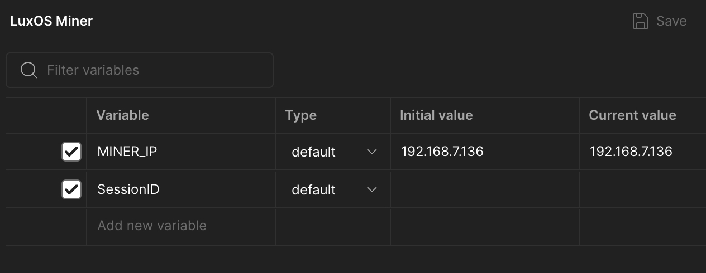

# LuxOS Fan Speed Adjustment

This repository provides tools and instructions to automate the adjustment of the `power_off_speed` parameter on the [Altair BitChimney](https://altairtech.io/product/bitchimney/) Bitcoin mining space heater.

   

## Overview

The provided Postman collection includes the following requests:

1. **Logon**: Initiates a session with the BitChimney device.
2. **Set Fan Speed**: Adjusts the `power_off_speed` parameter to the desired value.
3. **Logoff**: Terminates the session with the device.

These requests are designed to be executed sequentially to ensure secure and efficient parameter adjustment.

## Prerequisites

- **Postman**: Postman is a comprehensive API platform that simplifies building, testing, and managing APIs. It offers a user-friendly interface, making it accessible for users who prefer not to work with command-line tools. You can sign up for a free account using your email or Google account, which allows for easy access and collaboration. [Sign up for free](https://www.postman.com/).

## Setup Instructions

### Downloading the Repository as a ZIP File

1. **Access the Repository**:
   - Download this the repository's ZIP archive: [ZIP DOWNLOAD](https://github.com/marsmensch/AltairBitcoinChimneyFans/archive/refs/heads/main.zip)

2. **Extract the ZIP File**:
   - Locate the downloaded ZIP file on your computer (typically in the "Downloads" folder).
   - Right-click on the ZIP file and select **"Extract All..."** (Windows) or **"Open With > Archive Utility"** (macOS) to extract its contents.
   - Choose a destination folder for the extracted files and complete the extraction process.

### Importing into Postman

1. **Open Postman**:
   - Launch the Postman application on your computer.

2. **Import the Collection and Environment Files**:
   - Click the **"Import"** button located in the top-left corner of the Postman interface.
   - In the Import window, select the **"Upload Files"** tab.
   - Click **"Choose Files"** and navigate to the folder where you extracted the repository contents.
   - Select both `LuxOS_Chimney_FanAdjustment.postman_collection.json` and `LuxOS_Chimney_FanAdjustment.postman_environment.json` files by holding down the `Ctrl` (Windows) or `Command` (macOS) key and clicking on each file.
   - Click **"Open"** to import both files simultaneously.

   

3. **Configure Environment Variables**:

   

   - In Postman, click on the **"Environments"** tab on the left sidebar.
   - Locate and select the **"LuxOS Chimney FanAdjustment"** environment.
   - Click the **"Eye"** icon to view the environment variables.
   - Update the `MINER_IP` variable to the IP address of your BitChimney device.
   - Ensure the `SessionID` variable is present but leave its value empty; it will be populated automatically during the logon process.
   - Click **"Save"** to apply the changes.
   - Set the **"LuxOS Chimney FanAdjustment"** environment as active by selecting it from the environment dropdown in the top-right corner of Postman.

## Usage

1. **Run the Collection**:
   - In Postman, click on the **"Runner"** button (represented by a play icon) located in the top-left corner.
   - In the Collection Runner, select the **"LuxOS Chimney FanAdjustment"** collection.
   - Ensure the **"LuxOS Chimney FanAdjustment"** environment is selected.
   - Click **"Start Run"** to execute the sequence of requests.

   

2. **Verify Execution**:
   - After the run completes, review the responses to ensure that each step was successful.
   - Confirm that the `power_off_speed` parameter has been adjusted to the desired value.

## Command-Line Instructions for Advanced Users

For users comfortable with the command line, you can use `curl` or custom shell scripts to interact with the miner's HTTP API. Below are examples for both Unix-based systems (Linux/macOS) and Windows PowerShell.

This repository includes two example scripts to adjust the power_off_speed parameter.

- **Linux/macOS**: [Download shell.sh](https://raw.githubusercontent.com/yourusername/luxos-fan-adjustment/main/shell.sh)
- **Windows PowerShell**: [Download windows_powershell.ps1](https://raw.githubusercontent.com/yourusername/luxos-fan-adjustment/main/windows_powershell.ps1)
